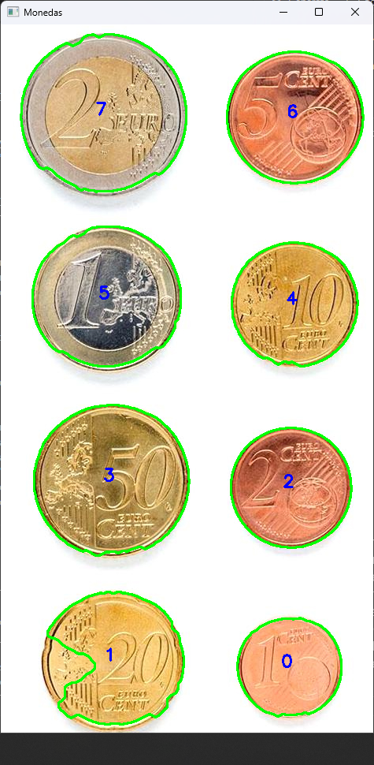
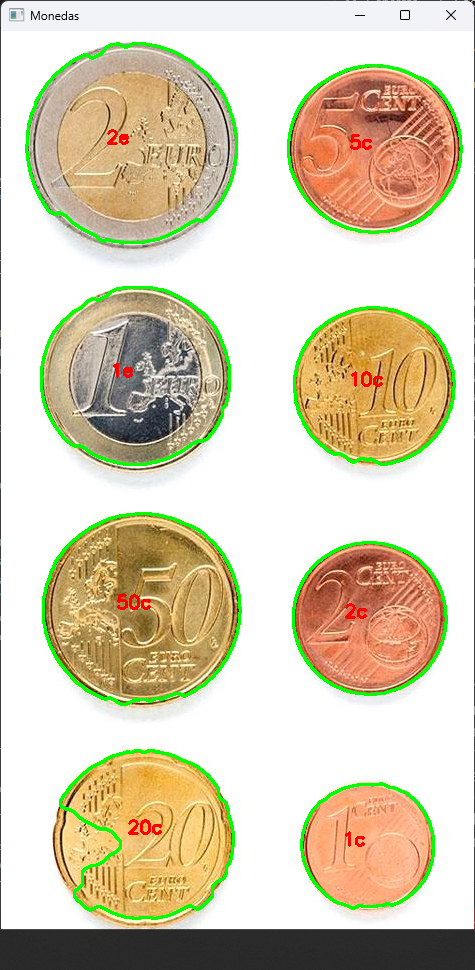
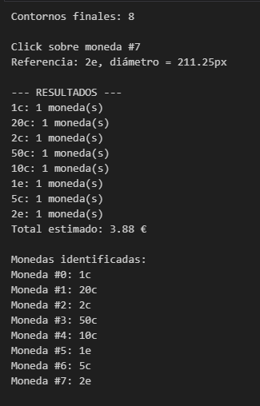
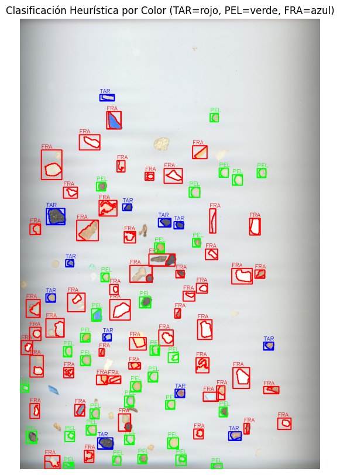
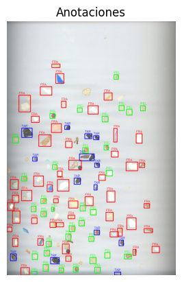

# Práctica 3
## Tarea 1
TAREA: Los ejemplos ilustrativos anteriores permiten saber el número de monedas presentes en la imagen. ¿Cómo saber la cantidad de dinero presente en ella? Sugerimos identificar de forma interactiva (por ejemplo haciendo clic en la imagen) una moneda de un valor determinado en la imagen (por ejemplo de 1€). Tras obtener esa información y las dimensiones en milímetros de las distintas monedas, realiza una propuesta para estimar la cantidad de dinero en la imagen. Muestra la cuenta de monedas y dinero sobre la imagen. No hay restricciones sobre utilizar medidas geométricas o de color.

Una vez resuelto el reto con la imagen ideal proporcionada, captura una o varias imágenes con monedas. Aplica el mismo esquema, tras identificar la moneda del valor determinado, calcula el dinero presente en la imagen. ¿Funciona correctamente? ¿Se observan problemas?

Nota: Para establecer la correspondencia entre píxeles y milímetros, comentar que la moneda de un euro tiene un diámetro de 23.25 mm. la de 50 céntimos de 24.35, la de 20 céntimos de 22.25, etc.

Extras: Considerar que la imagen pueda contener objetos que no son monedas y/o haya solape entre las monedas. Demo en vivo.

### Respuesta Tarea 1

Empezamos pasandole 2 listas y un diccionario, siendo los tipos de moneda, sus proporciones cogiendo un euro como base y en el diccionario va la relación entre la moneda con su valor.

Pasamos a realizar algunas funciones que nos ayudaran con los calculos. Ente ellas esta la función de **lista_proporcional(tipo)**, la cual sirve para normalizar las proporciones al tomar una moneda de referencia. La siguiente funcion es **hallar_valor(diametro_ref, diametro_nuevo, proporciones)** para determinar el tipo de moneda más cercano según la proporción de diámetros. La última de las funciones de apoyo es **calcular_diametro(cnt)** y devuelve el diámetro del círculo mínimo que contiene el contorno.

Procedemos a cargar la imagen y limpiarla. Usamos desenfoque gaussiano en la imagen en escala de grises y la pasamos a umbralizar usando Otsu. Pasamos a una limpieza morfológica para reducir ruido y unificar border usando funciones de cv2 como **getStructuringElement** y **morphologyEx**.
Ahora introducimos la detección de contornos y las filtramos las que tengan un contorno de un área mínimo y máximo. También si hay contornos muy cercanos los agrupamos para evitar duplicados de monedas.

Añadimos una copia de la imagen original para que el usuario interactue, establecemos un orden de las monedas y las enumeramos.

Al poner una imagen para que el usuario actue necesitamos hacer un evento que lea el clic del usuario. Creamos una función en la cual si lee un clic en una de las monedas aparece una pestaña en la que el usuario indica el tipo de moneda segun la lista inicial: ["2e", "1e", "50c", "20c", "10c", "5c", "2c", "1c"]. Una vez introducimos el valor correcto, se quitan las numeraciones y se escriben los valores de las monedas.
Es en este momento donde se calcula el valor total de las monedas en la imagen.

Al terminar la ejecución se indica las monedas identificadas por separado.

## Tarea 2
TAREA: La tarea consiste en extraer características (geométricas y/o visuales) de las tres imágenes completas de partida, y aprender patrones que permitan identificar las partículas en nuevas imágenes. Para ello se proporciona como imagen de test MPs_test.jpg y sus correpondientes anotaciones MPs_test_bbs.csv con la que deben obtener las métricas para su propuesta de clasificación de microplásticos, además de la matriz de confusión. La matriz de confusión permitirá mostrar para cada clase el número de muestras que se clasifican correctamente de dicha clase, y el número de muestras que se clasifican incorrectamente como perteneciente a una de las otras dos clases

### Respuesta Tarea 2
Para realizar la clasificación lo primero que hicimos fue, con las imágenes de entrenamiento coger ciertas características de los elementos y realizar las medias de estos, las características que cogimos fueron: área, perímetro, compacidad (), solidez (), Aspect Ratio, y la intensidad de los píxeles es decir el color. Con esto buscábamos informarnos de que características suelen tener en común los elementos de la misma clase y que características podríamos usar para diferenciarlos de las otras clases.

Para obtener que parte de la imagen observar, usamos el CSV y fuimos fila por fila, revisando las coordenadas que nos daban para realizar un recorte y tratar ese recorte, primero pasandolo a escala de grises, haciendo el threshold co Otsu y luego obtener los contornos. Una vez con los contornos simplemente quedaba realizar los cálculos dentro de estos para sacar las características de la misma forma que hicimos antes. Cada vez que obtenemos estas características añadimos a un dataframe una entrada con los datos para poder acceder a ellos más facilmente cuando vayamos a clasificar los objetos.

Una vez realizado esto, comenzamos a realizar el clasificador heurístico, habíamos hecho el estudio de las imagenes de entrenamiento con el plan de usar las medias de estos datos para ayudarnos a la hora de clasificar, pero al fijarnos en los datos que se captaban en la imagen de test, tanto el tamaño del área, perímetro e intensidad eran demasiado dispares con respecto a las de entrenamiento. 

Creemos que esto estaba causado por las diferencias de resolución y de iluminación entre las imágenes de entrenamiento y la de test, por lo que al final decidimos no usar esas medias directamente, pero si que nos fijamos en varias cualidades de los datos que captamos en las imágenes de entrenamiento. Por ejemplo entre elementos de la misma clase nos fijamos como de dispares podían ser las caracerísticas; en el caso de los Fragmentos sus tamaños eran los que más rango abarcaban, y de entre los 3 tipos de microplásticos que había, cuales de los fragmentos presentaban la menor solidez de entre todos. 

Con información de este estilo en mente empezamos a construir el clasificador heuristico, primero diferenciando por la solidez del microplástico, en caso de ser baja a continuación revisamos el AR, para intentar ver si es muy alargado o no, normalmente siendo alargados los TAR y FRA, mientras que los PEL son los que se quedan más circulares. Si es alargado lo que miramos para decidirnos entre FRA y TAR es la intensidad, en este caso, como dijimos antes la luz de la imagen era más alta que en las de entrenamiento, pero al ver que la mayor disparidad entre estas 2 clases provenía de la intensidad del objeto, fuimos probando valores de intensidad que estuviesen por encima de la media en esta parte del clasificador, hasta acabar con el que tenemos.

En el caso de que no fuese una partícula de baja solidez, nos fijamos en el área, dividiendo en 3 partes. Las partículas de área más pequeña son principalmente PEL, a simple vista por los datos de entrenamiento no nos lo parecía, pero al fijarnos en la imagen test y teniendo en cuenta que respecto a otros elementos los pellets son más circulares, vimos que la mayoría de objetos circulares son pequeños, entonces en caso de que fuesen pequeños decidiríamos los pellets y los fragmentos, pues estos son la clase que más rango tiene en cuanto a las áreas. Para clasificarlas entre esas dos clases, a continuación nos fijamos en la intensidad de los píxeles y en caso de que sean más oscuras las clasificamos como PEL y si no como FRAG. Para las partículas de tamaño medio, también decidimos entre FRA y PEL, esta vez probando con la compacidad, en este caso habíamos probado con anterioridad entre TAR y PEL, pero nos daba mejores resultados al clasificarlos como FRA. Por último las de tamaño más grande las clasificamos directamente como FRAG, no encontramos ninguna heurística mejor que la generalización para esta parte.

Con el clasificador ya hecho solo hace falta llamar a cada fila del dataframe para clasificarla, cada vez que se realiza una predicción se añade este dato, además de su clase real a la fila para así poder calcular el porcentaje de aciertos una vez se acabe. Tras acabar con la clasificación se procede a hacer las mismas ediciones sobre la foto de test que hizo el tutor, con un rectángulo de color y la clase sobre cada uno de los microplásticos pero esta vez el color y la clase se colocan en función de la clase predicha. Además de esto mostramos la matriz de confusión junto a los datos que hemos recogido de los microplásticos .

Con todo esto lo que hemos obtenido es un 78% de accuracy, según la matriz de confusión en lo que más fallamos a la hora de clasificar es más o menos lo mismo para las 3 clases, pero sin duda si hay alguna parte que mejorar es la de las partículas grandes. 

Si comparamos la imagen con la clasificación de los microplásticos que nos daba de ejemplo el profesor en el archivo VC_P3, podemos ver los fallos que ha cometido nuestro clasificador.

  
  

