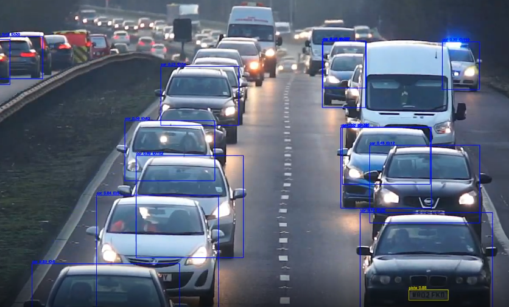
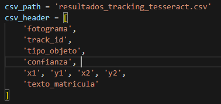
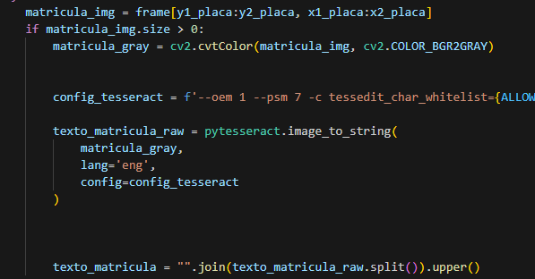
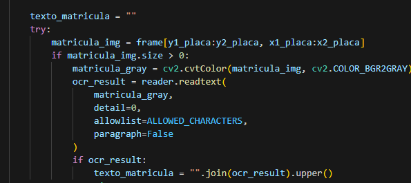
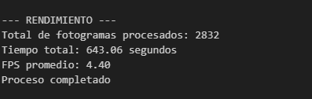
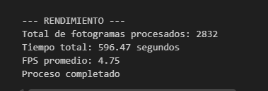
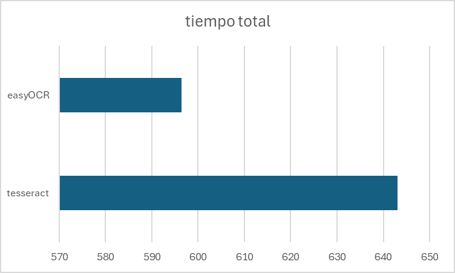
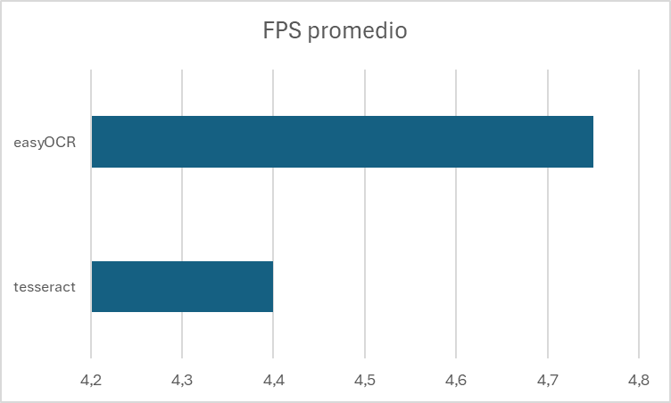
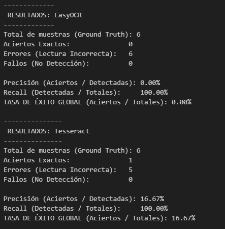

# Parte_A

Para la realización de la mitad de este trabajo a través del entrenamiento de un modelo de YOLO con Ultralytics hemos tomado los siguientes pasos:

## Creación del dataset
Para la creación del dataset, nos pusimos de acuerdo con un grupo de compañeros en sacar fotos de las matrículas y compartirlas entre todos para tener un buen conjunto de imágenes. Una vez se tenían las fotos sacadas se obtenía anotaba el rectángulo en el que se encontraba la matrícula usando la herramienta de anotación _labelme_. Con esto obteníamos el archivo json, con la clase 'plate' asociada a estos rectángulos. Para los archivos txt que contengan los valores <object-class-id> <x> <y> <width> <height>, hicimos uso de una función que recorriese la carpeta con los json y obtuviese los datos de los rectángulos anotados y que los transformase en sus equivalentes en txt, el número de la clase, y los datos de posición con sus valores entre 0 y 1. 

## Organización de las imágenes
Una vez todo esto estuviese listo, se procede a crear la estrcutura de entrenamiento a partir de las imágenes del dataset. Para ello se pone la ubicación de la carpeta del dataset y se especifica también la carpeta de los json o label, dependiendo de con que se vaya a realizar luego el entrenamiento. A continuación se hace una lista con todas las imágenes que se encuentren en la carpeta y luego se mezclan aleatoriamente, según el número de imágenes se pone hasta que imagen va en cada parte del conjunto de datos TGCRBNW. Una vez se tienen esos valores se crean si no están las carpetas de train, val y test para poder repartir las imágenes.

Con la estructura ya creada se revisa si las imágenes tienen su txt correspondiente, para que en caso de que la imagen no tenga su archivo con los datos para entrenarlo no se añada al dataset.

## Entrenamiento del modelo
Para entrenar el modelo de YOLO se ha utilizado CUDA para poder hacer uso de la GPU, por lo que lo primero que se hace es comprobar que nuestro enviroment tiene disponible el CUDA, y se revisan las versiones de PyTorch y de la versión CUDA compilada para que en caso de no tener disponible esta última se pueda revisar si el problema viene a causa de incompatibilidades entre las versiones. Cuando _torch.cuda.is_available()_ devuelva _True_, significa que se puede hacer uso de la GPU. 

```
print("PyTorch version:", torch.__version__)
print("CUDA available:", torch.cuda.is_available())
print("CUDA version (compiled):", torch.version.cuda)
print("GPU name:", torch.cuda.get_device_name(0) if torch.cuda.is_available() else "No GPU detected")

model = YOLO('yolo11n.pt')  

model.train(
    data=r"data.yaml",  # ruta a tu YAML
    epochs=50,       # número de épocas
    imgsz=720,        # tamaño de imagen
    batch=16,         # tamaño de lote
    name="matricula_yolo11n",  # nombre de la carpeta de resultados
    workers=1,        
    device=0          # GPU (usa "cpu" si no tienes CUDA)
)
```

Para el entrenamiento del modelo hemos ido probando distintas opciones los parámetros, cambiando principalmente los epochs, el tamaño de imagen y el tamaño de lote. Finalmente nos quedamos en los valores aquí presentes, destacando el tamaño de imagen de 720 pues aumentarlo más causaba problemas en la memoria GPU, estropeando la ejecución del entrenamiento. 

El archivo data.yaml, presenta el siguiente formato:
```
# rutas del dataset
#ACTUALIZAR A RUTAS ABSOLUTAS PARA PODER USARLO SIN FALLOS EL ENTRENAMIENTO
train: C:\Users\javie\Documents\TRABAJO UNI\VC\Vision_por_Computador\Práctica_4\Parte_A\TGC_RBNW\train\images
val: C:\Users\javie\Documents\TRABAJO UNI\VC\Vision_por_Computador\Práctica_4\Parte_A\TGC_RBNW\val\images
test: C:\Users\javie\Documents\TRABAJO UNI\VC\Vision_por_Computador\Práctica_4\Parte_A\TGC_RBNW\test\images

# número de clases
nc: 1

# nombres de las clases
names: [ 'plate']
```
En este archivo se especifican con que propósito se van a usar las diferentes carpetas durante el entrenamiento. Además se añade el número de clases y el nombre de estas para que el modelo asocie lo que aprenda de las imágenes y los labels.

## Detección usando vídeo de ejemplo
Para la detección de las matrículas se cargan 2 modelos, el modelo de YOLO yolo11n.pt que es el capaz de detectar personas y vehículos como se especifíca en la lista de clases, y en cuanto se detecte un coche se hará un recorte de este y se aplicará el modelo que se ha entrenado para intentar detectar la matrícula. Tras cargar ambos modelos se hace lo mismo con el vídeo de ejemplo, y se guarda la dirección del vídeo resultante junto con los parámetros que tendrá el vídeo de salida. También se preparan las columnas que trendrá el archivo csv cuando se vaya a crear. 

Con esto ya hecho se comienza con la detección frame por frame del vídeo, pasándole el modelo yolo11n.pt para detectar las personas y coches, en caso de que en el frame se detecte algo de esto se procede a crear un rectángulo con cv2 para marcarlo, azul para coches y verde para personas, poniendo también el grado de confianza que se tiene con esta detección y la clase que se ha predicho. En caso de detectar el coche se hace el recorte antes mencionado, se comprueba que el recorte sea válido y se le pasa el modelo que se ha entrenado con el dataset de matrículas. Del resultado de la predicción del segundo modelo también se obtienen la confianza de detección y las coordenadas del bounding box, con esto creamos un rectángulo amarillo sobre el que escribimos la confianza de la detección y la clase que ha detectado.

Por cada frame se crea una línea del csv que contiene:
```
fotograma, tipo_objeto, confianza, identificador_tracking, x1, y1, x2, y2, matrícula_en_su_caso, confianza, mx1,my1,mx2,my2, texto_matricula
```
En el archivo final, se han hecho detecciones con 2 vídeos diferentes, si se revisa se podrá comprobar que los códigos para analizar los vídeos son ligeramente diferentes entre ellos. Este cambio es a causa de un problema que surge por la gran la cantidad de elementos que hay en el segundo vídeo, que reveló un problema con el primer código. 

El primer código, como se explicó antes, detecta un coche, luego pasa el recorte del coche al modelo de las matrículas para detectarla y tras las detecciones se dibujan las cajas y se escriben las clases y el ID del objeto. Cuando esto se realiza con pocos coches no presenta mayor problema, pero en el segundo vídeo aparecen una gran cantidad de coches, y las cajas de detección de los coches que se encuentran detrás de otro coinciden con la caja del coche que se encuentra delante. 

Si se realizaba la escritura de la ID y la caja del coche de delante cabía la posibilidad de que cuando se detectase el coche que estaba detrás y se pasase el recorte de este, las letras de la clase y los números de ID se encontrasen dentro del recorte y al pasarlo al modelo de las matrículas este asumiese que esas letras y números eran una matrícula.

Para solucionar esto, se rehizo el código y esta vez se detecta todo primero, sin dibujar nada en el video, guardando las detecciones en el csv, y una vez se tenga todo el contenido en el csv se comienza a realizar frame por frame, a través de los datos guardados en las filas del csv, los dibujos de las cajas, IDs y nombres de la clases para devolver el vídeo con las detecciones realizadas marcadas.

Enlace vídeo con detección 1: https://drive.google.com/file/d/107lG1AuTHrROH-2lZs_kSJ0aOoq-rkZP/view?usp=sharing

Enlace vídeo con detección 2: https://drive.google.com/file/d/1AeGOB7w6UvyG5k8HDWL3KX89-ABKR0Hv/view?usp=drive_link

Tras las detecciones de los vídeos, se realiza un análisis del csv para ver cuantas IDs únicas de coche y persona se han detectado, que nos puede llevar a un aproximado del número real de elementos de cada tipo que aparecen en el vídeo.



# Parte_B

## Tesseract
Para el uso de Tesseract, primero hay que instalar los binarios desde el repositorio de la Universidad Manheim. También tenemos que descargar su wrapper mediante pip.

Una vez descargado, indicamos su ruta ya que no la definimos en la instalación. Cargamos nuestro modelo de matrículas y el modelo de yolo11. Asignamos unos carácteres permitidos y las clases que queremos del modelo de yolo11.

Pasamos a cargar el video y la salida del video procesado. Aprovechamos también para indicarle el csv, que va a tener los siguientes campos:



Empezamos a ver frame a frame el video, donde primero miramos para *trackear* en ambos modelos. Ahora pasamos a ver los resultados del modelo de yolo11 y si los ahi si son de la clase persona o coche les damos un identificador con su nombre de clase y su color, aprovechamos para tambien escribirlo en el csv. Hacemos lo mismo pero con las matriculas.

Con la matricula identificada se la recortamos y la pasamos a escala de grises donde configuramos el tesseract para que nos de solo la matrícula.



Después de esto ponemos en el video algo similar que con el modelo de yolo11 y le ponemos lo que ha leido entre corchetes.

También aprovechamos a calcular el tiempo que tarda en procesar el video entero. Guardamos el video y el csv.

[Link](https://drive.google.com/file/d/1wF87VPlLHaZJusweBrdMav2GrlDXRfHy/view) al video.

## EasyOCR

En cuanto al easyOCR contiene la misma manera de leer las variables y analizar el video que tesseract, cambiando cuando pasamos las matriculas al OCR. En este caso no hace falta hacer una configuración, solo decirlo que "detail=0" y "paragraph=false".



[Link](https://drive.google.com/file/d/1-8L2SVbBQU8_C_VBSXpgAZKrIefh5z56/view) al video.


## Comparativa Tesseract y EasyOCR

Esta es es tiempo de ejecución de tesseract:



Este es el tiempo de ejecución de EasyOCR:



Si los ponemos para visualizar de forma gráfica podemos ver que easyOCR tarda menos y con un mayor fps promedio. Si vemos tambien los resultados vemos que no acerto por completo ninguna a diferencia de tesseract que pudo acertar alguna. Por lo que con estos resultados el tesseract sería mejor si queremos seguir utilizando este modelo.





Una comparativa de resultados con 6 de las matriculas que se detectan con el modelo entrenado.



